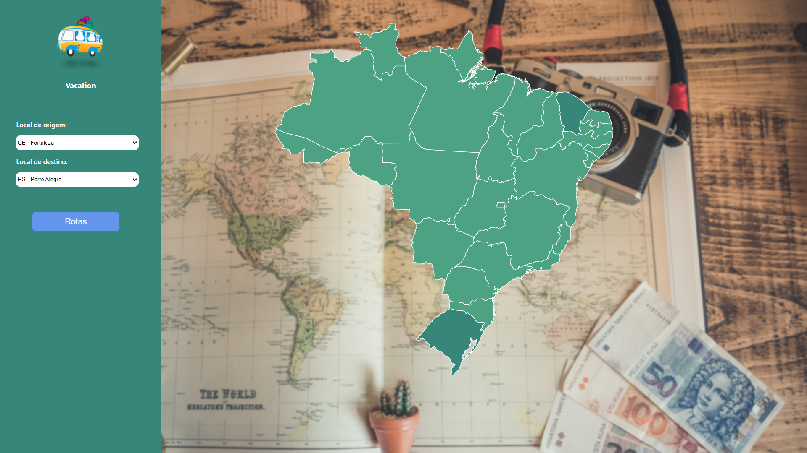
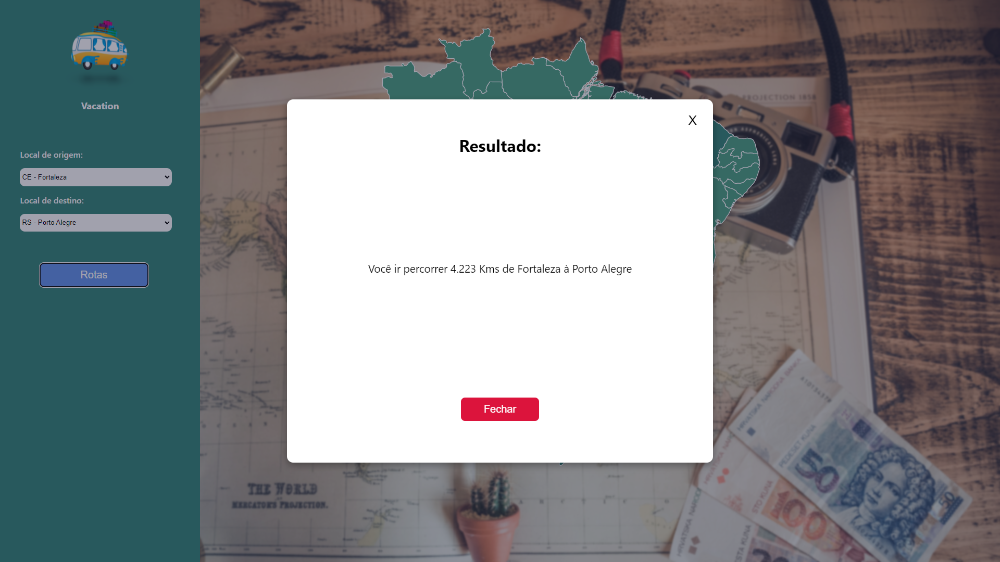

# Grafos 2 - Vacation


**Número da Lista**: 2<br>
**Conteúdo da Disciplina**: Grafos 2<br>

## Alunos
|Matrícula | Aluno |
| -- | -- |
| 16/0120918  |  Gabriel de Jesus Carvalho |
| 18/0054554  |  Paulo Batista |

## Sobre 
O vacation é uma aplicação de viajem, que considera apenas as capitais do Brasil como destinos válidos para viajar. Ela retorna a distancia minima entre as opções de viajem utilizando o algoritmo de Djikstra.

## Screenshots





## Instalação 
**Linguagem**: JavaScript<br>
**Framework**: React<br>
Para rodar o projeto é necessário ter o NodeJs e o Yarn instalados.

Para instalar as dependências: 

```
  yarn install
```
Para executar o projeto: 

```
  yarn start
```

## Uso 
Basta selecionar o estados de origem, estado de destino e gerar a distância.